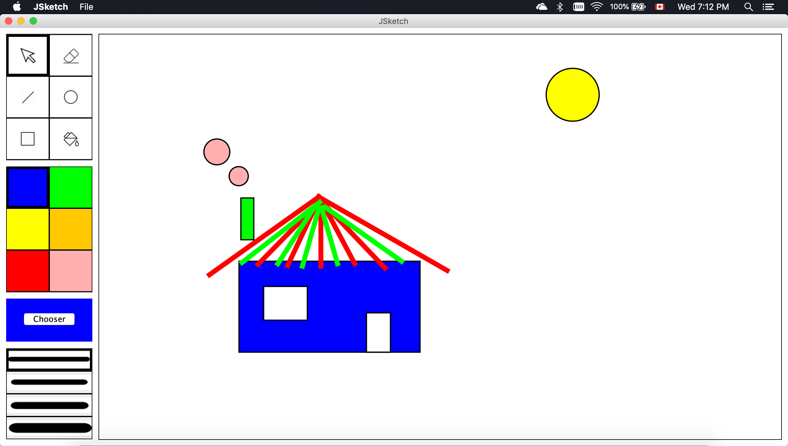

# JSketch :art:

### This application is developed in/for macOS

### Get Started

Run the following command in the root directory of the project:

```
gradle build
gradle run
```

### Additional features

   1. Customizable colour palette (right click on the color)

   2. Group shapes (click on empty space and drag to select)

### Some design decisions

   1. The saved drawing should has .jsketch extension in order to be properly exported/imported

   2. The menu bar has been integrated into macOS style (at very top of the screen)

   3. When drawing a circle, the radius is the distance between the point of mouse pressed and mouse dragged, I believe it is more intuitive to the user this way

### Screenshot of the application


